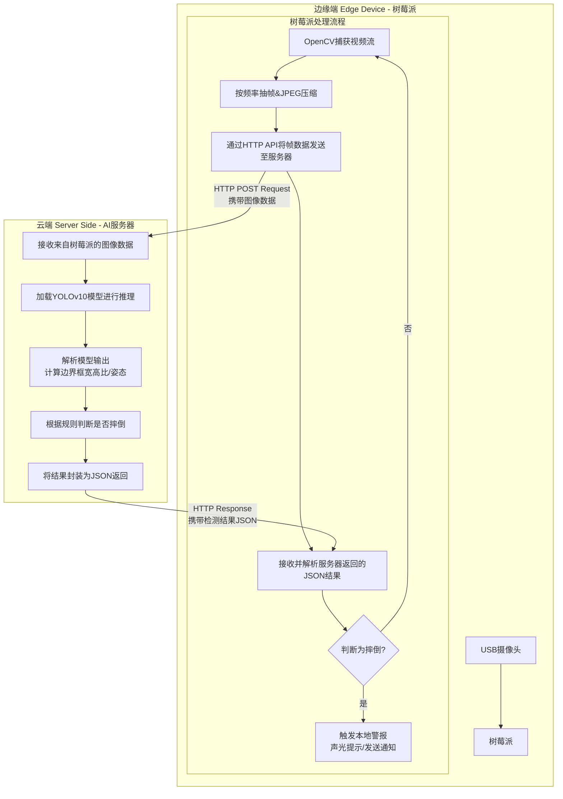
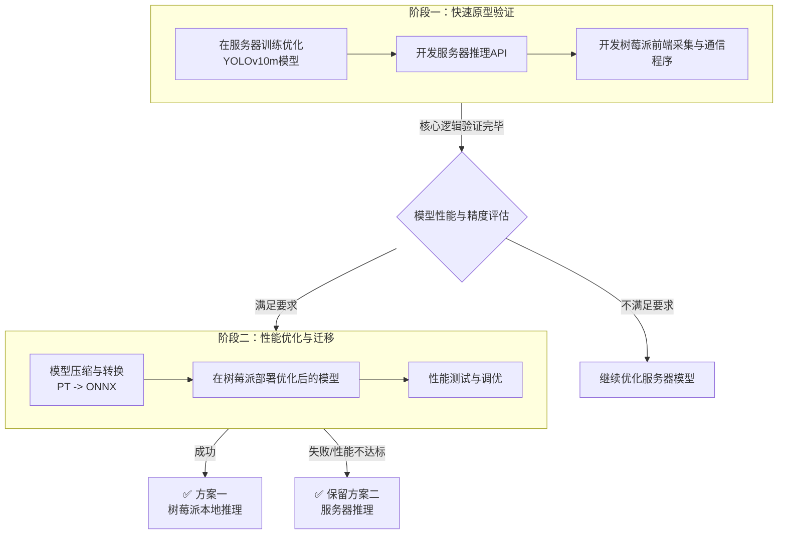

# 树莓派摔倒检测系统
# Fall Detection System 🚨

一个基于YOLOv10和树莓派的实时摔倒检测监控系统。本项目采用**边缘-云计算混合架构**，将计算密集的AI推理任务放在服务器上，而树莓派则专注于视频采集和警报触发，实现了性能与成本的最佳平衡。

## 文档

详细信息请参阅以下文档：

- [用户手册](./docs/user_manual.md) - 安装、配置和使用说明
- [开发指南](./docs/development_guide.md) - 开发和扩展指南
- [未来更新规划](./docs/future_updates.md) - 项目未来发展计划
- [数据准备教程](./docs/data_preparation_tutorial.md) - 训练数据准备和标注指南

有关开发流程和扩展功能的详细信息，请参阅[开发指南](./docs/development_guide.md).

## 🏗️ 系统架构

本系统由两部分组成：

1.  **边缘设备 (Edge Device)**:
    *   **硬件**: 树莓派 (Raspberry Pi) + USB摄像头。
    *   **职责**: 
        - 捕获实时视频流。
        - 按设定频率抽取视频帧并进行压缩。
        - 将帧图像通过HTTP API发送至远端AI服务器。
        - 接收服务器的分析结果，并在检测到摔倒时触发本地警报（如声光提示）。

2.  **AI服务器 (AI Server)**:
    *   **硬件**: 拥有GPU算力的PC或云服务器。
    *   **职责**:
        - 提供高性能的HTTP推理接口。
        - 加载训练好的YOLOv10摔倒检测模型。
        - 对接收到的图像进行实时推理与分析。
        - 根据边界框比例等规则判断是否发生摔倒事件。
        - 将判断结果以JSON格式返回给边缘设备。

## ⚡ 工作流程

1. 树莓派捕获视频并抽帧。
2. 图像被压缩并通过网络发送到AI服务器。
3. 服务器使用YOLOv10模型进行推理和摔倒判断。
4. 判断结果返回给树莓派。
5. 如果检测到摔倒，树莓派立即启动本地警报机制。


## ✨ 特点

-   **高精度识别**: 利用YOLOv10强大的目标检测能力，专门针对摔倒场景进行训练。
-   **低成本部署**: 树莓派作为前端，硬件成本极低。
-   **灵活可扩展**: 服务器可以同时为多个树莓派前端提供服务，易于构建分布式监控网络。
-   **实时响应**: 尽管有网络传输开销，但系统仍能保证快速的检测和报警响应。
-   **隐私保护**: 图像数据可在局域网内处理，无需上传至公有云。

## 📁 项目结构

```
Keen/
├── data/
│   ├── object/                  # 原始目标图片数据
│   ├── train/                 # 训练集
│   ├── val/                   # 验证集
│   ├── video/                 # 视频数据
│   └── object_dataset.yaml      # 数据集配置文件
├── src/
│   ├── api/                   # API服务模块
│   ├── train/                 # 初始训练模块
│   ├── retrain/               # 重训练模块
│   ├── data_processing/       # 数据处理模块
│   ├── events/                # 事件处理模块
│   ├── config/                # 配置管理模块
│   ├── exceptions/            # 异常处理模块
│   ├── utils/                 # 工具模块
│   └── tests/                 # 测试模块
├── models/                    # 模型保存目录
├── docs/                      # 文档目录
├── logs/                      # 日志目录
├── config.json                # 全局配置文件
├── requirements.txt           # 项目依赖
└── README.md
```

## 创建环境

```shell
conda create -n keen --override-channels -c https://mirrors.tuna.tsinghua.edu.cn/anaconda/pkgs/main/ python=3.9
```

安装依赖

```shell
conda activate keen
pip install -r requirements.txt -i https://mirrors.aliyun.com/pypi/simple/
```

## 项目模块说明

### 1. 数据处理模块

处理原始图片数据，创建标签文件，并将数据拆分为训练集和验证集。

```bash
cd src/data_processing

python prepare_data.py
```

数据准备格式：
将图片按照以下结构存放：

```
data/object/
├── object1/
│   ├── img1.jpg
│   ├── img2.jpg
│   └── ...
├── object2/
│   ├── img1.jpg
│   ├── img2.jpg
│   └── ...
└── ...
```

每个子文件夹代表一种目标对象，文件夹名为对象名称。

还支持其他数据处理功能：
- 图片爬虫：从网络爬取目标图片
- 视频抽帧：从视频中提取帧作为训练数据
- 视频下载：从JSON文件中批量下载视频
- 图片保存：将JSON数据中的图片保存到本地

#### 视频抽帧功能

支持从视频中抽取帧作为训练数据：
```bash
cd data_processing
python video_extractor.py --input_dir ../data/video --output_dir ../data/object_video_frames
```

#### 视频下载功能

支持从JSON文件中批量下载视频：
```bash
cd data_processing
python video_downloader.py --json_file video.json --output_dir ../data/videos
```

#### 图片爬虫功能

支持从网络爬取目标图片：
```bash
cd data_processing
python image_scraper.py --keywords 西红柿 鸡蛋 牛奶 --limit 50 --output ../data/object
```

### 2. 初始训练模块

用于从头开始训练目标检测模型。

```bash
cd src/train
python train_model.py --data_config ../../data/object_dataset.yaml --epochs 100 --save_dir ../../models
```

在 macOS 上训练时会自动使用 MPS 加速（如果可用）。

### 3. 重训练模块

在已有模型基础上进行增量训练。

```bash
cd src/retrain
python retrain_model.py --model_path ../../models/object_model/weights/best.pt --data_config ../../data/object_dataset.yaml --epochs 50 --save_dir ../../models
```

### 4. API服务模块

提供视频目标检测的API服务。

```bash
cd src/api
python app.py
```

启动后访问 `http://localhost:5000` 查看API信息。

实时摄像头检测：
```bash
cd src/api
python camera_detector.py --model_path ../../models/object_model/weights/best.pt
```

按 'q' 键退出摄像头检测。

本地视频文件检测：
```bash
cd src/api
python local_video_detector.py --model_path ../../models/object_model/weights/best.pt --video_path /path/to/video.mp4
```

### 5. 事件处理模块

当识别到目标时触发事件，支持多种处理方式：
- 日志记录
- 语音播报
- 外部接口调用
- Kafka消息推送

该模块采用解耦设计，可以轻松扩展新的事件处理方式。

事件处理由配置文件控制，默认只启用了日志记录事件监听器。

### 6. 配置管理模块

项目使用统一的配置管理机制，所有模块通过读取配置决定自己的行为。

配置文件位于项目根目录的 [config.json](file:///Users/zhangpeng/Desktop/zpskt/refrigerator-object-detector/config.json) 文件中，可以控制以下功能：

```json
{
  "event_handlers": {
    "log": true,     
    "tts": false,    
    "api": false,    
    "kafka": false   
  },
  "tts": {
    "enabled": false,
    "rate": 200,
    "voice": "default"
  },
  "api": {
    "enabled": false,
    "endpoint": ""
  },
  "kafka": {
    "enabled": false,
    "bootstrap_servers": ["localhost:9092"],
    "topic": "object-detection-events"
  },
  "logging": {
    "enabled": true,              
    "file": "logs/object_detection.log",  
    "level": "INFO",              
    "max_bytes": 10485760,        
    "backup_count": 5             
  }
}
```

要启用特定功能，只需修改配置文件中对应项为 `true` 并填写相关配置即可。

运行示例脚本查看效果：
```bash
cd src/events
python run_example.py
```

### 7. 异常处理模块

项目定义了统一的异常类型，所有自定义异常都继承自 `objectRecognitionException` 基类。

### 8. 工具模块

包含日志配置等通用工具函数。

### 9. 测试模块

包含单元测试代码。

### 10. 改进的摄像头检测显示

摄像头检测功能现在提供了更好的可视化效果：
- 改进了边界框和标签的显示效果
- 添加了检测到的目标列表显示
- 增加了调试信息显示
- 优化了文本可读性

使用方法：
```bash
cd src/api
python camera_detector.py --model_path ../../models/object_model/weights/best.pt --conf_threshold 0.5
```


## 🚀 快速开始

1.  **服务器端部署**: 在AI服务器上安装依赖，启动推理API服务。
2.  **树莓派端设置**: 配置树莓派Python环境，修改客户端脚本中的服务器IP地址。
3.  **运行**: 先启动服务器，然后在树莓派上运行客户端脚本即可。

*(具体安装和运行步骤请参考后续详细文档)*

### 数据准备

```shell
cd data_processing
python prepare_data.py --download 
```
### 训练
```shell
cd src/train
python train_model.py --data_config ../../data/fall_detection/fall_dataset.yaml --epochs 100 --save_dir ../../models
```

## 新功能和改进



